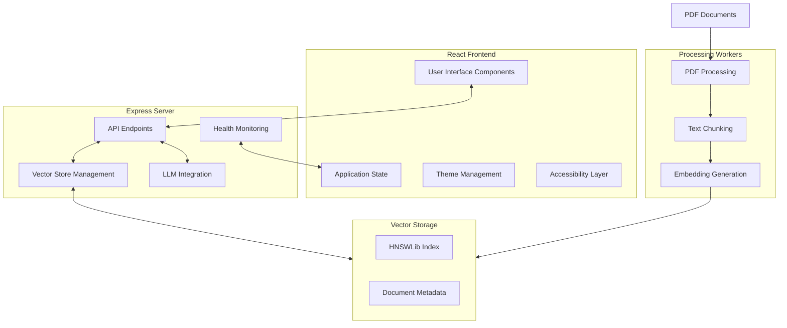
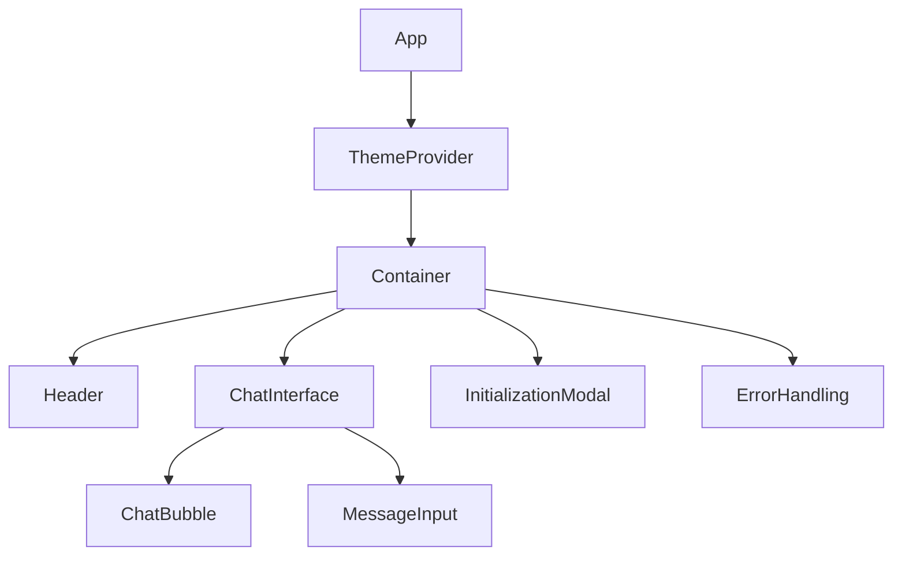
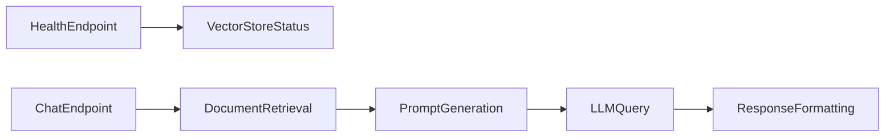
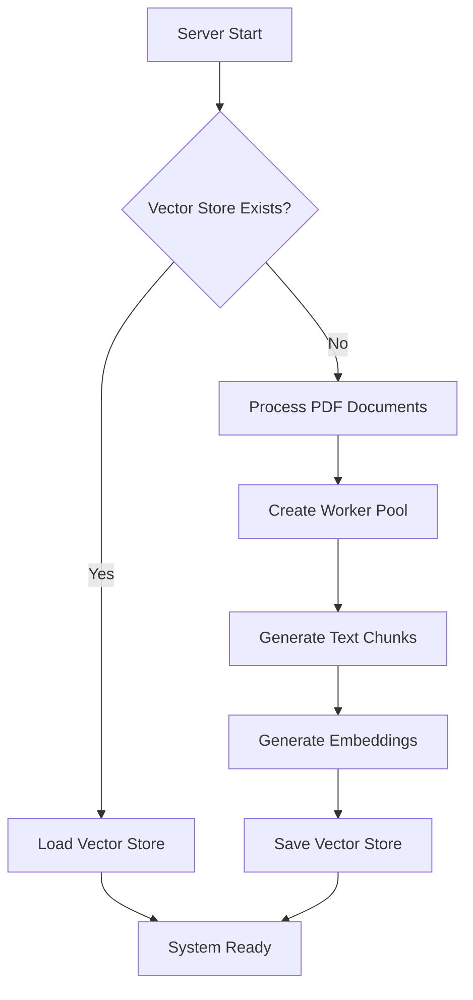

# System Patterns: Ableton Documentation Assistant

## System Architecture

The application follows a client-server architecture with the following components:

## Key Technical Decisions

### RAG Implementation
- **Retrieval**: Uses HNSWLib for efficient similarity search
- **Augmentation**: Retrieves top relevant context from documentation
- **Generation**: Uses Ollama's Mistral model for answer generation
- **Response Format**: Returns formatted markdown with source context

### PDF Processing Strategy
- **Parallel Processing**: Uses worker threads to process PDFs
- **Batched Processing**: Handles large documents in manageable chunks
- **Page Distribution**: Divides PDF pages across multiple workers
- **Progress Tracking**: Monitors initialization process in real-time

### Vector Store Management
- **Persistence**: Saves vector store to disk for fast startup
- **Memory Efficiency**: Processes in batches to limit memory usage
- **Embedding Model**: Uses Ollama for consistent embeddings
- **Metadata Preservation**: Maintains source information for context

### Frontend Design Patterns
- **Component-Based**: Modular React components with clear responsibilities
- **Progressive Enhancement**: Core functionality works with minimal dependencies
- **Adaptive Design**: Automatic light/dark mode based on system preferences
- **Accessibility First**: Built-in screen reader support and keyboard navigation

## Component Relationships

### Frontend Component Hierarchy

### Backend Component Flow

### Initialization Flow

## Event Flow

### User Query Flow
1. User enters question in UI
2. Frontend sends request to backend API
3. Backend retrieves relevant context from vector store
4. Context is combined with question in prompt template
5. Prompt is sent to Ollama LLM for processing
6. Response is formatted with markdown
7. Response and source context are returned to frontend
8. Frontend displays response with formatting and source references

### Error Handling Flow
1. Error occurs in system component
2. Error is logged with details
3. Generic error message is returned to user
4. UI displays error notification
5. System remains operational for future queries

## Design Patterns Used

- **Singleton Pattern**: Single instance of vector store and LLM
- **Factory Pattern**: Creating worker instances
- **Observer Pattern**: Progress monitoring and updates
- **Repository Pattern**: Access to vector store data
- **Facade Pattern**: Simplified API for complex backend operations
- **Strategy Pattern**: Different processing approaches based on context
- **Decorator Pattern**: Enhanced components with accessibility features