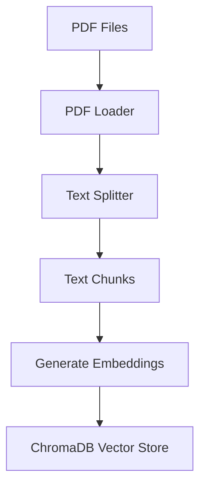

# Technical Context: Ableton Documentation Assistant

## Technology Stack

### Frontend Technologies
- **React**: Core UI library
- **Material-UI (MUI)**: Component framework
- **CSS-in-JS**: Styling approach with MUI's styling system
- **React Markdown**: For markdown rendering
- **Syntax Highlighter**: For code block formatting

### Backend Technologies
- **Node.js**: Runtime environment (v20 LTS)
- **Express**: Web server framework
- **Worker Threads**: For parallel processing
- **LocalAI**: Local LLM serving for GPT-4o
- **LangChain**: Framework for LLM application development

### PDF Processing
- **PyPDF**: Python PDF processing library
- **LangChain Document Loaders**: For PDF document handling
- **Recursive Character Text Splitter**: For document chunking

### Vector Store & Embeddings
- **ChromaDB**: Vector database for document storage and similarity search
- **OpenAI Compatible Embeddings**: For generating text embeddings via LocalAI
- **Sentence Transformers**: Backend embedding model

## Development Setup

### Prerequisites
- Node.js 20+ LTS
- Python 3.10 (specifically) for ChromaDB compatibility
- LocalAI installed with GPT-4o model
- ChromaDB server running on port 8000

### Python Dependencies
- pypdf
- langchain
- sentence-transformers
- numpy
- chromadb==1.0.7

### Installation Steps
1. Clone the repository
2. Install JS dependencies with `npm install`
3. Create Python 3.10 virtual environment with `python3.10 -m venv chromadb_venv`
4. Activate the environment with `source chromadb_venv/bin/activate`
5. Install Python dependencies in the virtual environment
6. Place Ableton PDF documentation in `/pdf` directory
7. Start LocalAI with GPT-4o model
8. Start ChromaDB server using `./start-chromadb.sh` (which uses the `chroma run` command)
9. Run application (`npm start`)

### Starting ChromaDB Server
ChromaDB 1.0.7 provides a dedicated command-line tool called `chroma` that must be used to start the server:

```bash
# Activate the Python 3.10 environment
source chromadb_venv/bin/activate

# Start ChromaDB using the chroma command-line tool
chroma run --host 0.0.0.0 --port 8000 --path ./vector_store
```

Key parameters:
- `--host`: Sets the listening address (0.0.0.0 listens on all interfaces)
- `--port`: Sets the server port (8000 by default)
- `--path`: Specifies the directory for persistent storage

> **Important**: Do NOT attempt to start ChromaDB server using `python -m chromadb.app` as this approach doesn't work correctly with ChromaDB 1.0.7. Always use the `chroma run` command.

## Technical Constraints

### Performance Constraints
- **Memory Usage**: PDF processing requires significant memory for large documents
- **CPU Usage**: Embedding generation is CPU-intensive
- **Startup Time**: Initial processing of PDFs can take 30-60 minutes
- **Response Time**: LLM generation affects response speed

### Compatibility Constraints
- **Browser Support**: Modern browsers required for full functionality
- **OS Requirements**: macOS, Linux, or Windows with LocalAI support
- **Hardware Requirements**: 
  - Minimum 16GB RAM (for GPT-4o Local)
  - Multi-core CPU recommended
  - SSD storage for faster vector retrieval
  - GPU recommended for accelerated inference

### Security Constraints
- **Local Processing**: All data stays local, no external API calls
- **File Access**: Limited to PDF files in designated directory
- **No Authentication**: Designed for personal use, no user authentication

## Dependencies

### Runtime Dependencies
```json
{
  "cors": "^2.8.5",
  "express": "^4.19.2",
  "langchain": "^0.1.9",
  "@langchain/community": "^0.0.35",
  "@langchain/openai": "^0.0.15",
  "@langchain/text": "^0.1.0",
  "node-fetch": "^3.3.2",
  "chromadb": "^1.7.3",
  "react": "^18.2.0",
  "react-dom": "^18.2.0",
  "react-markdown": "^9.0.1",
  "@mui/material": "^5.15.2",
  "@mui/icons-material": "^5.15.2",
  "@emotion/react": "^11.11.3",
  "@emotion/styled": "^11.11.0"
}
```

### Development Dependencies
```json
{
  "vite": "^5.0.8",
  "@vitejs/plugin-react": "^4.2.1",
  "eslint": "^8.55.0",
  "jest": "^29.7.0",
  "@testing-library/react": "^14.1.2",
  "@testing-library/jest-dom": "^6.1.5"
}
```

## Infrastructure

### Local Development
- Express server on port 3000
- Vite dev server for frontend (proxies to Express)
- LocalAI service running on port 1234
- ChromaDB server running on port 8000

### File Storage
- PDF files in `/pdf` directory
- Vector store data managed by ChromaDB

### Processing Pipeline


## Technical Debt & Considerations

- **Error Recovery**: Improved handling of PDF processing failures
- **Progress Persistence**: Save progress during long initialization
- **Incremental Updates**: Support for updating vector store with new documents
- **Model Switching**: Allow changing LLM models without reprocessing
- **Caching**: Response caching for frequently asked questions
- **User Preferences**: Saving UI preferences
- **Multi-document Support**: Better handling of multiple PDF sources
- **Visualization**: Visualization of vector relationships