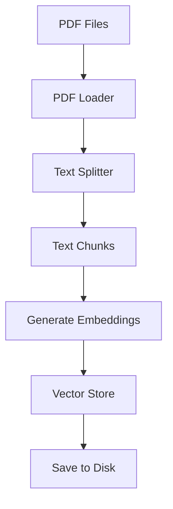

# Technical Context: Ableton Documentation Assistant

## Technology Stack

### Frontend Technologies
- **React**: Core UI library
- **Material-UI (MUI)**: Component framework
- **CSS-in-JS**: Styling approach with MUI's styling system
- **React Markdown**: For markdown rendering
- **Syntax Highlighter**: For code block formatting

### Backend Technologies
- **Node.js**: Runtime environment
- **Express**: Web server framework
- **Worker Threads**: For parallel processing
- **Ollama**: Local LLM serving
- **LangChain**: Framework for LLM application development

### PDF Processing
- **PyPDF**: Python PDF processing library
- **LangChain Document Loaders**: For PDF document handling
- **Recursive Character Text Splitter**: For document chunking

### Vector Store & Embeddings
- **HNSWLib**: Efficient vector storage and similarity search
- **Ollama Embeddings**: For generating text embeddings
- **Sentence Transformers**: Used via Ollama for embeddings

## Development Setup

### Prerequisites
- Node.js 18+
- Python 3.8+ for PDF processing
- Ollama installed (via `brew install ollama` on macOS)
- Mistral model pulled (`ollama pull mistral`)

### Python Dependencies
- pypdf
- langchain
- sentence-transformers
- numpy

### Installation Steps
1. Clone the repository
2. Install JS dependencies with `npm install`
3. Install Python dependencies
4. Place Ableton PDF documentation in `/pdf` directory
5. Start Ollama (`brew services start ollama`)
6. Run application (`npm start`)

## Technical Constraints

### Performance Constraints
- **Memory Usage**: PDF processing requires significant memory for large documents
- **CPU Usage**: Embedding generation is CPU-intensive
- **Startup Time**: Initial processing of PDFs can take 30-60 minutes
- **Response Time**: LLM generation affects response speed

### Compatibility Constraints
- **Browser Support**: Modern browsers required for full functionality
- **OS Requirements**: macOS, Linux, or Windows with Ollama support
- **Hardware Requirements**: 
  - Minimum 8GB RAM
  - Multi-core CPU recommended
  - SSD storage for faster vector retrieval

### Security Constraints
- **Local Processing**: All data stays local, no external API calls
- **File Access**: Limited to PDF files in designated directory
- **No Authentication**: Designed for personal use, no user authentication

## Dependencies

### Runtime Dependencies
```json
{
  "cors": "^2.8.5",
  "express": "^4.18.2",
  "langchain": "^0.0.167",
  "@langchain/community": "^0.0.23",
  "node-fetch": "^3.3.2",
  "react": "^18.2.0",
  "react-dom": "^18.2.0",
  "react-markdown": "^8.0.7",
  "@mui/material": "^5.14.12",
  "@mui/icons-material": "^5.14.12",
  "@emotion/react": "^11.11.1",
  "@emotion/styled": "^11.11.0"
}
```

### Development Dependencies
```json
{
  "vite": "^4.4.11",
  "@vitejs/plugin-react": "^4.1.0",
  "eslint": "^8.51.0",
  "jest": "^29.7.0",
  "@testing-library/react": "^14.0.0",
  "@testing-library/jest-dom": "^6.1.3"
}
```

## Infrastructure

### Local Development
- Express server on port 3000
- Vite dev server for frontend (proxies to Express)
- Ollama service running locally

### File Storage
- PDF files in `/pdf` directory
- Vector store in `/vector_store` directory:
  - `hnswlib.index`: Vector index file
  - `docstore.json`: Document metadata
  - `args.json`: Vector store configuration

### Processing Pipeline


## Technical Debt & Considerations

- **Error Recovery**: Improved handling of PDF processing failures
- **Progress Persistence**: Save progress during long initialization
- **Incremental Updates**: Support for updating vector store with new documents
- **Model Switching**: Allow changing LLM models without reprocessing
- **Caching**: Response caching for frequently asked questions
- **User Preferences**: Saving UI preferences
- **Multi-document Support**: Better handling of multiple PDF sources
- **Visualization**: Visualization of vector relationships